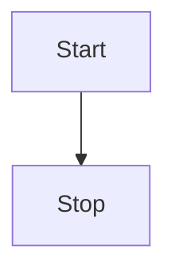

# Phone Provision

Provision, config and upgrade AudioCodes IP Phone's using docker container.

Can also be used with other phones eg Poly, Yealink, etc, if you have a request for a specific phone then create an issue.

## Important Pre-requisites

* Certificate Required, Personally I use Lets Encrypt, just load the certificate and private key into \files\cert folder as cert.pem and cert.key respectively.
* download firmware from AudioCodes website and copy to /files/firmware directory.
* update the /files/json/firmware.json file to match the particular firmware you want downloaded.
* update the /files/json/config.json (see below)
* Modify static configs if required
  * compatible - teams config for 3pip devices.
  * native - config for native teams devices.
  * sfb - sfb config.
  * sip.cfg - sip config.

## Building the Docker image


### Login to github

```Login
docker login  ghcr.io -u username
```

### Build and push Docker Firmware Image

```docker
docker build . -t ghcr.io/shanehoey/phoneprovision:firmware

```

### Build Docker Image

```docker
docker build . -t ghcr.io/shanehoey/phoneprovision:latest
docker build . -t ghcr.io/shanehoey/phoneprovision:dev
```

### Push to github container registry

```docker

docker push ghcr.io/shanehoey/phoneprovision:firmware
docker push ghcr.io/shanehoey/phoneprovision:latest
docker push ghcr.io/shanehoey/phoneprovision:dev

```

## Create azure container

```azurecli

az container create \
    --resource-group shoey_containers \
    --name phoneprovision \
    --dns-name-label phoneprovision \
    --ip-address public \
    --location australiaeast \
    --image ghcr.io/shanehoey/phoneprovision \
    --restart-policy OnFailure \
    --environment-variables 'WEBSITES_CONTAINER_START_TIME_LIMIT'='1200' \
    --ports 443 \
    --registry-login-server ghcr.io \
    --registry-username shanehoey \
    --registry-password  
    
```

## Delete azure container

```azurecli

az container delete \
    --resource-group shoey_containers \
    --name phoneprovision 
```
    

## Troubleshooting

* Make sure that all firmware files are unblocked when you download them

## Ideas

* TODO : P2 : liquid configs
* TODO : config based on firmware type
* TODO : Dynamic URL for config files eg /config/teams/?p=10&a=8
* TODO : logs to work out whats been updated previously ?
* TODO : Update documents

## Release Information

### version

* pre-release March 2021 - Proof of concept demo
* pre-release June 2021 - Minor Updates
* pre-release November 2021 - updated firmware, and additional routes for phone types
* v1.00 pre-release November 2021 - Ability to do firmware overrids
* v1.01 pre-prelease December 2021 - split to multiple layers to assist with caching 

### Acknowledgements

* [nodejs](https://github.com/nodejs/)
* [liquidjs](https://github.com/liquidjs)
* [express](https://github.com/expressjs)
* [helmet](https://github.com/helmetjs)


